Container image for Ncdu - a disk usage analyzer with an ncurses interface. It is designed to find space hogs on a remote server where you don’t have an entire graphical setup available, but it is a useful tool even on regular desktop systems.

## Usage

### Calculate disk usage

```shell
docker run --rm -it --privileged -v $(pwd):/host:ro ghcr.io/r-xs-fi/ncdu /host/tmp
```

Outputs:
```console
ncdu 1.17 ~ Use the arrow keys to navigate, press ? for help
--- /host/tmp ----------------------------------------------------------------------------------------------------------------------------------------------------------------------------------------------------------------------------
    1.4 GiB [#################################] /build
   46.5 MiB [#                                ]  fog-hyper-from-container
    3.9 MiB [                                 ] /uppdatera
    1.7 MiB [                                 ]  Varasto_on-20231007T102417Z-001.zip
    1.7 MiB [                                 ] /vlb-100
  336.0 KiB [                                 ]  26916151.pdf
  236.0 KiB [                                 ]  Peek 2023-10-15 18-27.mp4
   24.0 KiB [                                 ]  Peek 2023-10-15 18-05.mp4
```

## Supported platforms


| OS    | Architecture  | Supported | Example hardware |
|-------|---------------|-----------|-------------|
| Linux | amd64 | ✅       | Regular PCs (also known as x64-64) |
| Linux | arm64 | ✅       | Raspberry Pi with 64-bit OS, other single-board computers, Apple M1 etc. |
| Linux | arm/v7 | ✅       | Raspberry Pi with 32-bit OS, older phones |
| Linux | riscv64 | ✅       | More exotic hardware |

## How does this software get to me?

```mermaid
flowchart TD
    subgraph "Origin"
        sourcerepo["Original source repo"]
    end
    subgraph "Alpine infrastructure"
        Alpine_build[Alpine build machine]
        Alpine_package[Alpine package registry: ncdu 🔗]

        click Alpine_package "https://pkgs.alpinelinux.org/package/edge/community/x86/ncdu"
    end
    subgraph "Packaging build"
        rxsfi_build["r.xs.fi build (GitHub Actions)"]
    end
    subgraph "Container Registry"
        r_xs_fi_package_registry[ghcr.io/r-xs-fi/ncdu 🔗]

        click r_xs_fi_package_registry "https://ghcr.io/r-xs-fi/ncdu"
    end
    subgraph "user"
        docker_run[$ docker run ...]
    end
    sourcerepo -- downloads --> Alpine_build -- stores --> Alpine_package
    Alpine_package -- download --> rxsfi_build
    rxsfi_build -- push --> r_xs_fi_package_registry
    r_xs_fi_package_registry -- pull --> docker_run[$ docker run ...]

```


